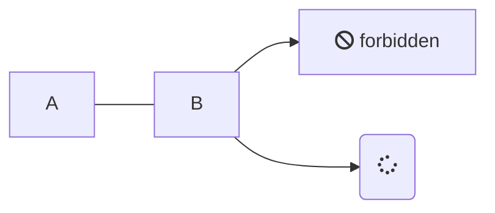
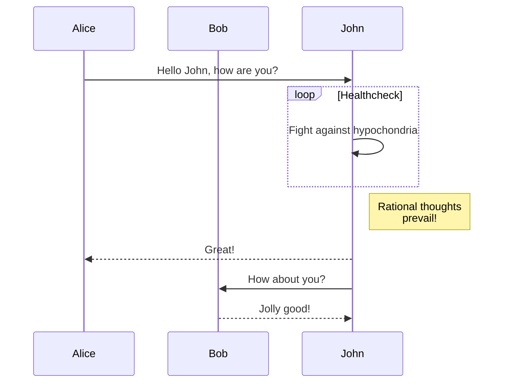

# 3. DISEÑO DEL MODELO DE DATOS

Distinguir cuales son las entidades involucradas en el sistema y mencionarlas en un 	formato Human Readable. Esta información debe iniciar con un diagrama y presentar los datos de entrada, datos internos y datos de salida.

### Mermaid

Enlace a la documentación [https://mermaid-js.github.io/mermaid](https://mermaid-js.github.io/mermaid)

**Flujo:**

**Secuencia:**

